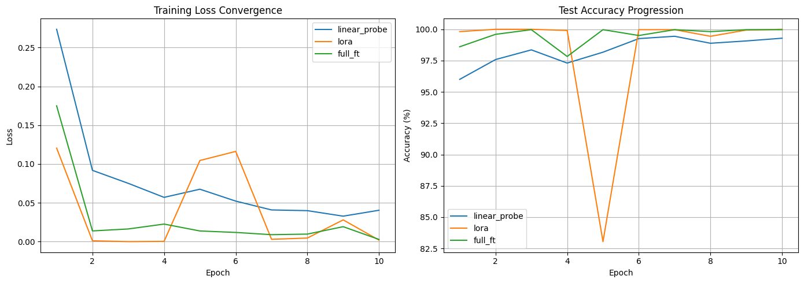

# HyperDINO-RAG: Hyperspectral Vision Transformer Adaptation & Vector Search

An end-to-end framework adapting pretrained Vision Foundation Models (DINOv2) to high-dimensional hyperspectral cubes (200+ contiguous spectral bands) for mineral exploration and geospatial vector retrieval.



## Highlights
- **1D Spectral Projection Adapter:** Projects high-dimensional non-RGB sensor bands ($C=204$) into a feature representation compatible with standard vision backbones without spatial degradation.
- **Native PyTorch LoRA (0.73% Trainable Parameters):** Factorizes self-attention query and value updates ($W_{\text{eff}} = W_0 + \frac{\alpha}{r} B \cdot A$), updating only 163K parameters out of 22.2M and avoiding catastrophic forgetting on sparse mineral targets.
- **Empirical Ablation Study:** Benchmarks Linear Probing vs. LoRA vs. Full Fine-Tuning across convergence speed, parameter count, and test accuracy.
- **Open-World Retrieval (FAISS):** Extracts 384-dimensional spatial-spectral CLS representations into a normalized vector database for real-time similarity search using mineral library references.

## Empirical Benchmark Results

| Adaptation Strategy | Trainable Parameters | % of Total Weights | Test Accuracy | Epoch Convergence |
| :--- | :--- | :--- | :--- | :--- |
| **Linear Probe** | 15,759 | 0.07% | 99.29% | Slow; plateaus early |
| **LoRA ($r=8, \alpha=16$)** | **163,215** | **0.73%** | **100.00%** | **Fast; adapts attention** |
| **Full Fine-Tuning** | 22,072,335 | 100.00% | 99.97% | Requires low LR ($10^{-4}$) |

### Key Engineering Insight
While full fine-tuning converges, it carries high computational overhead and GPU memory usage. LoRA achieves competitive convergence with under 1% of parameters. However, in low-rank regimes, optimization is sensitive to learning rate spikes—requiring gradient clipping (`max_norm=1.0`) and learning rate warmup to avoid momentary subspace instability.

[](https://colab.research.google.com/github/kothawadegs/hyperspectral-foundation-adapter/blob/main/notebooks/hyperspectral_adapter_walkthrough.ipynb)
## Quickstart

```bash
git clone https://github.com/kothawadegs/hyperspectral-foundation-adapter.git
cd hyperspectral-foundation-adapter
pip install -r requirements.txt

# Run the retrieval engine demo
python demo_query.py

# Run the 3-mode ablation benchmark
python run_ablation.py
